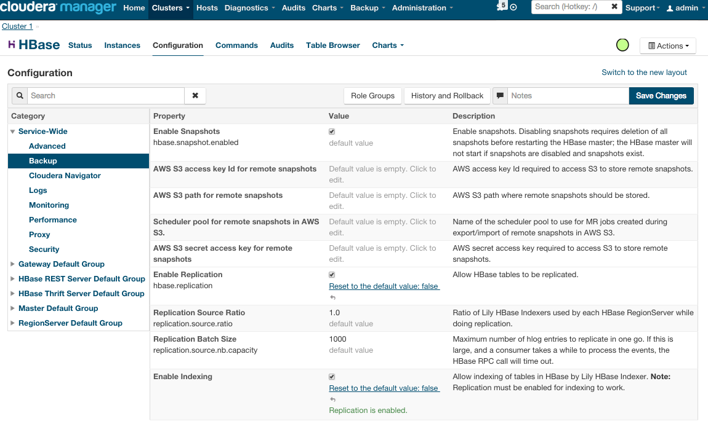
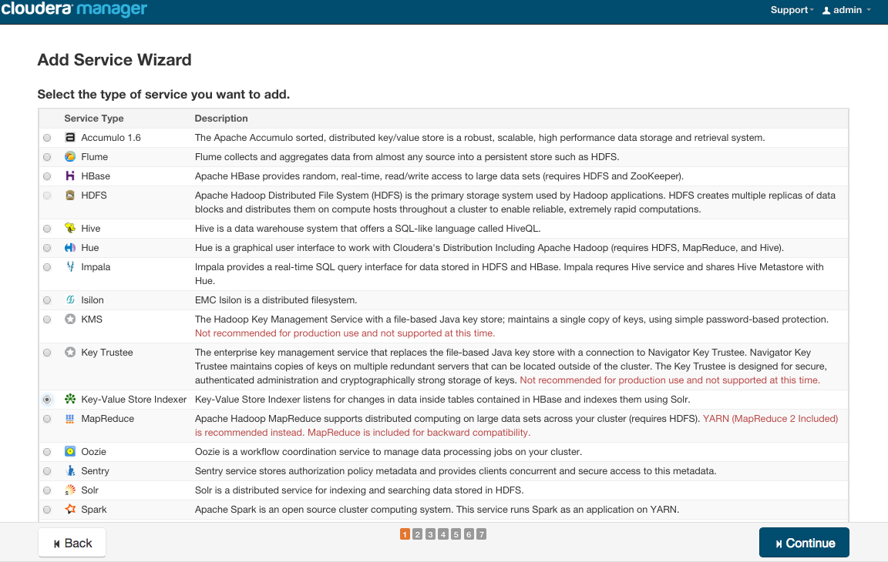
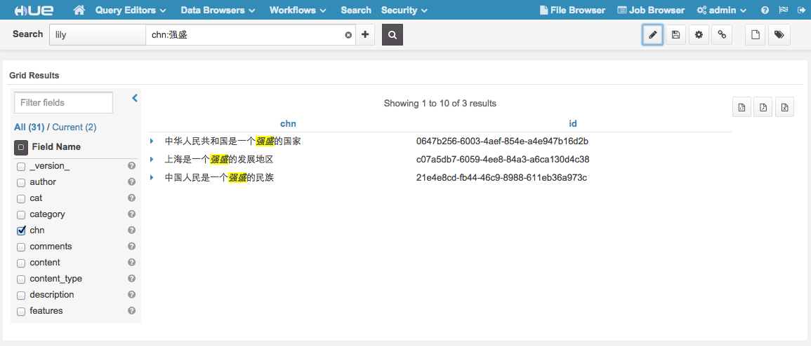

ngdata-index
=======

This example demonstrates how to set up a NRT search engine in CDH

#####Configure HBase
1. Enable replication
2. Enable indexing

#####Add "Key-Value Store Indexer" Service

#####Create solr collection
Please see https://github.com/yeleid/solrchn/tree/master/build-collection for more details

#####Add HBase Indexer

    ./ngdata_index.py -c lily -i myindexer -z ip-172-31-34-88.us-west-2.compute.internal

#####Configure morphline in Key-Value Store Indexer
Copy content from indexer/indexer-morphline.conf 

#####Create HBase table

    hbase shell hbase/create.hbase

#####Write data into table 'record', column family 'user'
you can leverage hbase shell or rest interface (https://github.com/yeleid/hbaserest)

#####Search in HUE

